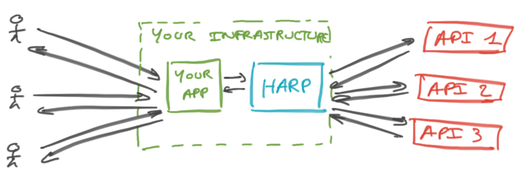

HARP – Harp, an API Runtime Proxy
=================================

HARP is a sidecar proxy service raising reliability, performances, security and observability of your application's
external API usage. It can be seen as a revers API gateway, or a nearline service mesh for external API.

* It integrates with your application in a few minutes: run it, change your API endpoints and you're good to go.
* As a nearline proxy, the network distance between your application and external services is lowered to the minimum.
* Caching, monitoring, alerting, rate limiting, circuit breaking, retries, tracing, logging, etc. can be delegated to
  the proxy, greatly reducing the amount of (hard) code you need to write.
* It speak HTTP, so the integration (or removal) cost is barely 0 (or negative, if you consider all code you won't need
  to write).
