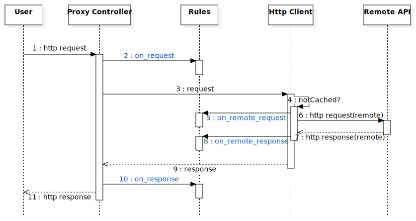

Rules
=====

.. versionadded:: 0.6

.. warning:: Early prototype. The API may change, a lot.

The ``rules`` application implements a powerful way to customize your proxies with specific rules. It works by allowing
to apply a set of rules to different stages of the proxy controller.

Rules are python code, and are applied in order to requests matching some patterns.

Lifecycle
:::::::::

During the lifecycle of a transaction, 4 hooks are available:

* ``on_request`` will trigger on each request received by the proxy controller, allowing early filtering/tuning of a
  request.
* ``on_remote_request`` will trigger every time the proxy needs to actually send an http request to the remote endpoint.
  This won't happen for requests that HIT the cache, or that does not need remote access for whatever reason. It
  allows to filter the external http request just before it's sent out.
* ``on_remote_response`` will trigger every time the proxy receives a response from the remote endpoint. It allows to
  filter the response before it's processed by the proxy. For example, it's a good place to override the response
  cache-control headers to tune the cache behavior for some transactions.
* ``on_response`` will trigger every time the proxy is about to send a response to the client.

Syntax
::::::

The early prototype of the rules engine uses rules definition based on 3-levels of pattern matching:

- **endpoint**: the first level allows to filter on which endpoints should match, by endpoint name.
- **request**: the second level allows to filter on the request's fingerprint.
- **stage**: the fird level allows to filter on which stage the filter should apply.

Under those three levels, you'll find a list of python code blocks that will be compiled and executed when the
matching events occurs.

.. literalinclude:: examples/rules.yml

Each stage will provide some locals to work with:

- ``request``: the request object (available in request-related stages)
- ``response``: the response object (available in response-related stages)
- ``endpoint``: the endpoint name
- ``logger``: a python logger instance

Recipes
:::::::

Force some (sub) endpoints to cache the response for a given time
:::::::::::::::::::::::::::::::::::::::::::::::::::::::::::::::::

.. code-block:: yaml

    rules:
        "my-endpoint":
            "GET /foo/bar":
                on_remote_response:
                    response.headers['Cache-Control'] = 'max-age=3600'
