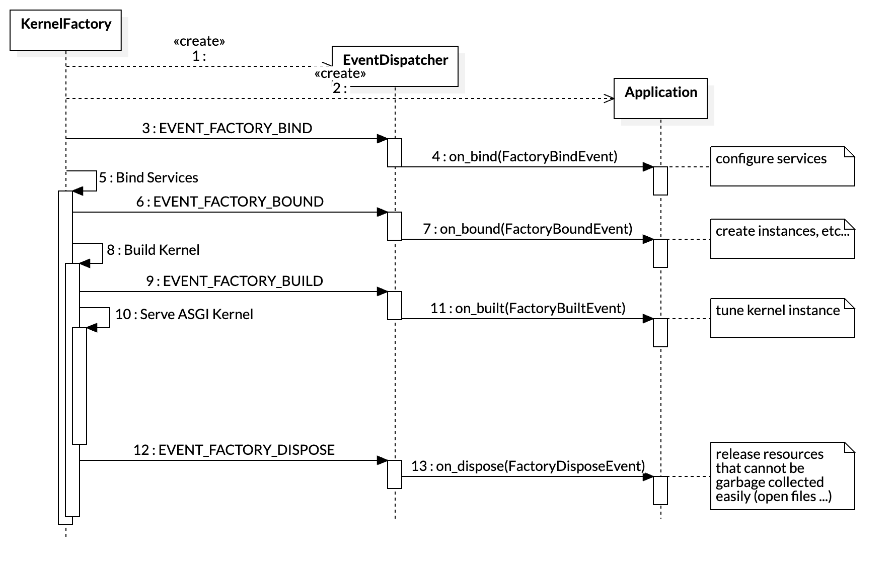

__app__.py (required)
=====================

The ``__app__.py``file is required for harp applications and should contain one subclass of
:class:`harp.config.Application` named after the last part of the application's package name.

For example, if your application is defined in the ``foo.bar.baz`` package, the ``__app__.py`` file should contain a
``Baz`` class that inherits from :class:`harp.config.Application`.

Please look at existing examples for content details, for now.

The lifecycle of each loaded application will look like the following simplified sequence diagram:

   Application lifecycle
