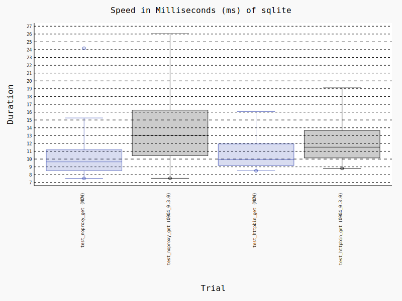

Version 0.3.2 (2024-01-02)
==========================

Changes
:::::::

* feat(dashboard,ui): fix erroneous import from different copies of headlessui (Romain Dorgueil)
* feat(dashboard): fix invalid import (Romain Dorgueil)
* feat(dashboard,ui): tab component, applied on dashboard settings page (Romain Dorgueil)
* feat(cli): fix service names in cli start command (Romain Dorgueil)
* chore(deps-dev): bump rollup-plugin-visualizer in /frontend (dependabot[bot])
* chore(deps-dev): bump @typescript-eslint/parser in /frontend (dependabot[bot])
* chore(deps-dev): bump @types/node from 20.10.5 to 20.10.6 in /frontend (dependabot[bot])
* chore(deps-dev): bump vite-tsconfig-paths in /frontend (dependabot[bot])
* chore(deps-dev): bump @types/react in /vendors/mkui (dependabot[bot])
* chore(deps-dev): bump @typescript-eslint/eslint-plugin in /frontend (dependabot[bot])
* Create dependabot.yml (Romain Dorgueil)
* feat(dashboard/settings): better dependencies format (Romain Dorgueil)
* feat(dashboard/settings): remove comments from pip freeze in dependencies tab (Romain Dorgueil)
* feat: add system dependencies in settings tab (Romain Dorgueil)
* feat: override version in docker builds to show pending release commits (Romain Dorgueil)
* feat: fix missing dev dependencies error and cleanup obsolete example (Romain Dorgueil)
* feat: upgrade hypercorn to 0.16 (Romain Dorgueil)
* feat: fixes around whistle 2.x changes (Romain Dorgueil)
* feat: normalize subprocess proxy usage to work the same with dashboard and userland subprocess servers (Romain Dorgueil)
* feat: use defaults constant defined in manager (Romain Dorgueil)
* feat: rename harp services to enhance readbility and avoid potential conflicts with common names like "frontend" (Romain Dorgueil)
* feat: allow to add proxied subprocesses on command line, set internal subprocesses to listen to high unprivileged ports (Romain Dorgueil)
* chore: update submodule (Romain Dorgueil)
* feat: debugging tools and better typing (Romain Dorgueil)
* feat: separate fron/back format (Romain Dorgueil)

Benchmarks
::::::::::

PostgreSQL
----------

.. figure:: benchmarks/0.3.2-postgresql.svg

SQLite
----------

