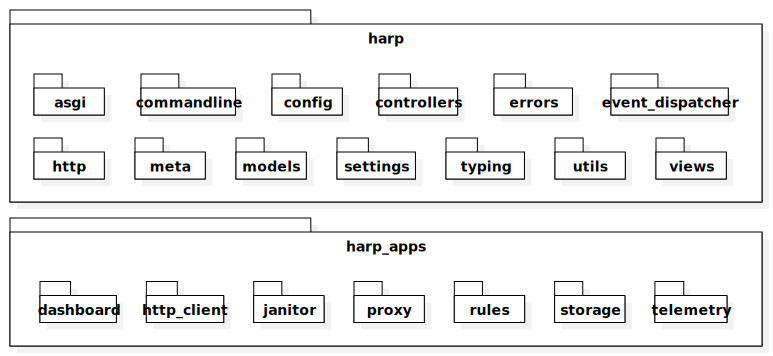

Overview
========

Codebase
::::::::

The codebase is divided into two main parts: Core and Applications. The Core (found under the ``harp`` python package)
provides the base functionality and tools for building proxy services, while Applications (either built-in or
user-provided) are independent modules that provide the real features.

The built-in applications are found under the ``harp_apps`` python package.

Core Packages
:::::::::::::

* **ASGI** (:mod:`harp.asgi`): Building blocks for ASGI (Asynchronous Server Gateway Interface)
* **Command Line** (:mod:`harp.commandline`): Core commands and building blocks for application-specific commands.
* **Config** (:mod:`harp.config`): Configuration management system, supporting various formats and sources.
* **Controllers** (:mod:`harp.controllers`): Building blocks for web controllers, turning requests into responses.
* **Errors** (:mod:`harp.errors`): Exception classes and error handling tools.
* **Event Dispatcher** (:mod:`harp.event_dispatcher`): Event handling system, based on :mod:`whistle`.
* **HTTP** (:mod:`harp.http`): Building blocks for HTTP.
* **Meta** (:mod:`harp.meta`): Metadata management tools.
* **Models** (:mod:`harp.models`): Data modeling for core objects (not tied to storage logic, «plain old python objects»).
* **Typing** (:mod:`harp.typing`): Type and interface definitions.
* **Utils** (:mod:`harp.utils`): A collection of utility functions and helper classes that provide common functionality needed across the application.
* **Views** (:mod:`harp.views`): Presentation layer for controllers (may be merged with controllers in the future).

Concepts
::::::::

HARP employs several common software engineering concepts and patterns to organize the codebase and ensure various
components work together while remaining loosely coupled.

Inversion of Control (IoC) & Dependency Injection (DI)
------------------------------------------------------

:ref:`Dependency Injection (DI) <di>` is a design pattern where an object's dependencies are provided by an external
source rather than the object creating them itself.

:ref:`Inversion of Control (IoC) <ioc>` is a design principle where the control of object creation and management is
transferred from the application code to a container or framework. This allows for more flexible and modular code, as
dependencies are injected into objects rather than being created by them.

Both principles are implemented to make the code more modular and easier to test.

:doc:`👀 Read more about the concepts and HARP implementation of the Dependency Injection Container
<dependency-injection>`.

Event Driven Architecture
-------------------------

An :ref:`Event Driven Architecture (EDA) <eda>` emits or receives events occurring in different parts of a system.
Events can be network-based, like in microservice architectures with an event bus (e.g., CQRS or event-sourcing
systems), or internal to a process, like in HARP, allowing components to communicate and extend each other without tight
coupling. This makes the software easier to maintain, as listeners do not need to know about the emitters and vice
versa.

HARP implements it using :mod:`Whistle <whistle>`, a dead simple Python event dispatcher, allowing applications easily
expose or hook into what happens in the system.

Pluggable Applications
----------------------

.. todo:: XXX Write this section

Sequence Diagram
::::::::::::::::

When an HTTP request comes into HARP, the following sequence of operations happens:

Once the Services Provider is up, most services will be instanciated lazily, on a (user) request basis, just in time.

Logging
:::::::

The logging system is based on the standard Python logging module, with a few customizations to fit our needs.

To use the logging system in your own modules, do the following:

.. code-block:: python

    from harp import get_logger

    logger = get_logger(__name__)

    logger.debug("This is a debug message")
    logger.info("This is an info message")
    logger.warning("This is a warning message")
    logger.error("This is an error message")
