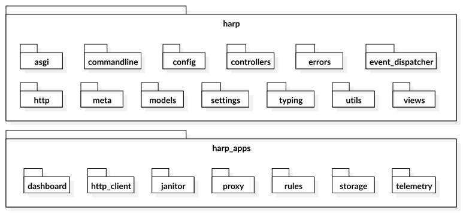
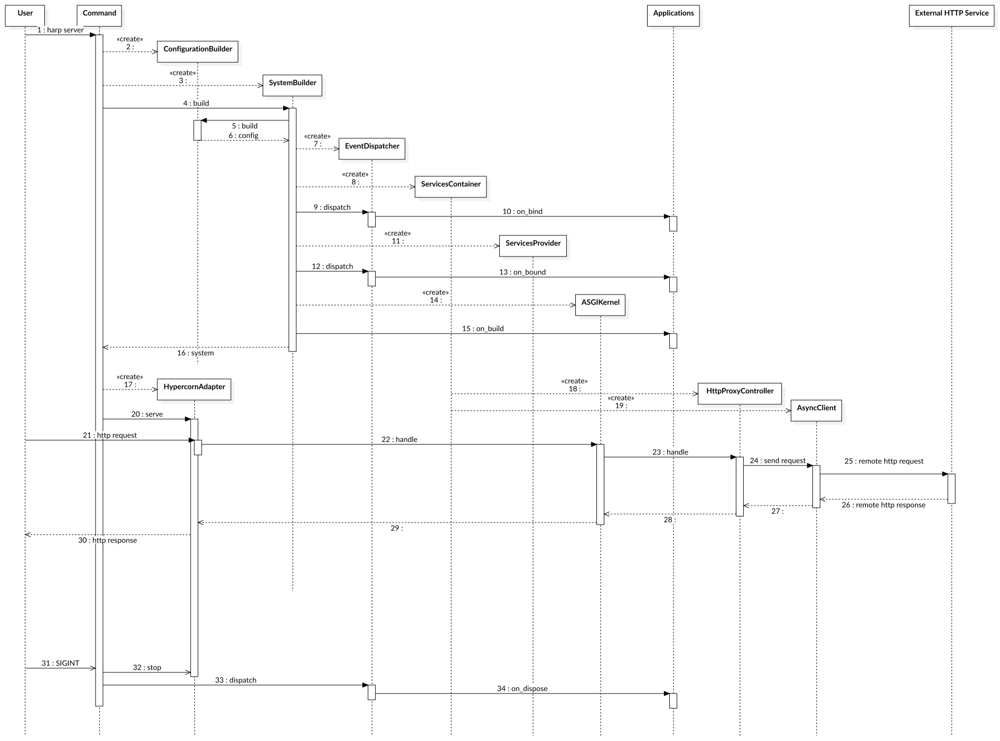

Overview
========

HARP's architecture is designed around modularity, loose coupling, and extensibility. This page provides a high-level
overview of the architecture and core concepts.

Codebase structure
::::::::::::::::::

The codebase is divided into two main parts:

**Core** (``harp`` package)
    Provides the base functionality and tools for building proxy services. The core is framework code that applications
    build upon.

**Applications** (``harp_apps`` package)
    Independent modules that provide features. Both built-in and user-provided applications use the same integration
    mechanism.

Core packages
:::::::::::::

* **ASGI** (:mod:`harp.asgi`) - Building blocks for ASGI (Asynchronous Server Gateway Interface)
* **Command line** (:mod:`harp.commandline`) - Core commands and building blocks for application-specific commands
* **Config** (:mod:`harp.config`) - Configuration management system supporting various formats and sources
* **Controllers** (:mod:`harp.controllers`) - Building blocks for web controllers, turning requests into responses
* **Errors** (:mod:`harp.errors`) - Exception classes and error handling tools
* **Event dispatcher** (:mod:`harp.event_dispatcher`) - Event handling system based on :mod:`whistle`
* **HTTP** (:mod:`harp.http`) - Building blocks for HTTP
* **Meta** (:mod:`harp.meta`) - Metadata management tools
* **Models** (:mod:`harp.models`) - Data modeling for core objects (plain old Python objects, not tied to storage)
* **Typing** (:mod:`harp.typedefs`) - Type and interface definitions
* **Utils** (:mod:`harp.utils`) - Collection of utility functions and helper classes
* **Views** (:mod:`harp.views`) - Presentation layer for controllers

Core concepts
:::::::::::::

HARP employs several software engineering patterns to organize the codebase and ensure components work together while
remaining loosely coupled.

Dependency injection and inversion of control
----------------------------------------------

:ref:`Dependency Injection (DI) <di>` is a design pattern where an object's dependencies are provided by an external
source rather than the object creating them itself.

:ref:`Inversion of Control (IoC) <ioc>` is a design principle where the control of object creation and management is
transferred from the application code to a container or framework.

Both principles make the code more modular and easier to test. HARP uses :mod:`rodi` for dependency injection.

:doc:`👀 Read more about Dependency Injection <dependency-injection>`

Event-driven architecture
--------------------------

An :ref:`Event-Driven Architecture (EDA) <eda>` allows components to communicate and extend each other without tight
coupling. Events can be network-based (like in microservice architectures) or internal to a process (like in HARP).

HARP uses :mod:`Whistle <whistle>`, a simple Python event dispatcher, allowing applications to easily expose or hook
into system events.

:doc:`👀 Read more about Events <events>`

Pluggable applications
----------------------

Applications are independent modules that integrate with HARP through a standard protocol. Both core features and
third-party extensions use the same mechanism.

Applications hook into the system through lifecycle events (:ref:`on_bind <on_bind>`, :ref:`on_bound <on_bound>`,
:ref:`on_ready <on_ready>`, :ref:`on_shutdown <on_shutdown>`) and can register services, listen to events, and extend
functionality.

:doc:`👀 Read more about Applications <applications>`

Request flow
::::::::::::

When an HTTP request comes into HARP, the following sequence of operations happens:

Once the Services Provider is initialized, most services are instantiated lazily, on demand, just in time.
