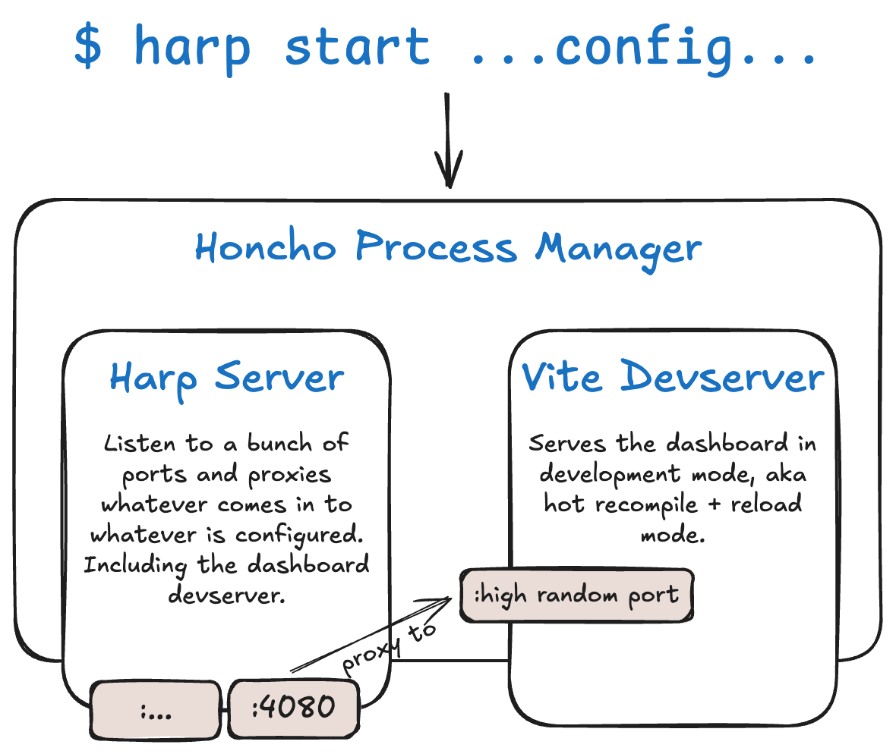

Setup
=====

This guide walks you through setting up a local HARP development environment.

System requirements
:::::::::::::::::::

You will need the following tools installed on your machine:

- Git and GNU Make
- A working Python 3.13+ environment with the ``uv`` package manager installed.
- A working NodeJS (lts/iron) environment with the ``pnpm`` package manager installed.
- A working Docker + Docker Compose environment.

.. note::

    * :doc:`./misc/ubuntu`

Getting the source code
:::::::::::::::::::::::

Download the source code using ``git clone``:

.. code-block:: bash

    git clone git@github.com:msqd/harp.git
    cd harp

Installing dependencies
:::::::::::::::::::::::

Install the project's dependencies in an isolated virtual environment:

.. code-block:: bash

    make install-dev

This will install the dependencies in a separate virtual environment (managed by uv) and set up the development
environment.

.. note::

    Depending on your system, you may get a warning about playwright not finding the system dependencies it needs. This
    is only required if you want to run the browser based tests, and can be safely ignored. On a linux system, you can
    install the missing dependencies with:

    .. code-block:: bash

        (cd harp_apps/dashboard/frontend; pnpm exec playwright install-deps)

Running your first development server
::::::::::::::::::::::::::::::::::::::

Start a HARP development server based on your local working copy.

Here, we'll run one using one of the built-in examples (but the same applies to any configuration, of course):

.. code-block:: bash

    uv run harp-proxy start --example sqlite

Open your browser at http://localhost:4080 to have a look at the HARP dashboard.

Using ``harp-proxy start`` (or ``uv run harp-proxy start`` to let uv manage the env, our preference) will spawn
a bunch of processes, managed by `honcho <https://pypi.org/project/honcho/>`_, with some free cherries.

The default processes are:

- ``harp-proxy server``: the main server, python based, which will listen for incoming requests on different ports. By
  default, it listens to the 4080 port for the dashboard. Wrapped using `watchfiles
  <https://watchfiles.helpmanual.io/>`_ to restart on code changes.
- the dashboard's devserver (`vite <https://vite.dev/>`_ based): listens to a high random unprivileged port by default,
  and the main server will forward requests to this port. Meaning that harp dashboard's goes through the http proxy.
  Kinda meta, right?

You can read more about the various ``harp-proxy`` commands in the :doc:`Command Line Reference </commandline/index>`.

Development interfaces
::::::::::::::::::::::

The main developer interface is a ``Makefile``, containing the most common tasks you'll need to run. Get a list by
running:

.. code-block:: bash

    make help

For anything requiring a valid environment to run, you can use the ``uv run harp-proxy`` command, which will run the HARP
CLI within the uv-managed virtual environment.

See :doc:`makefile` for more details about available make targets.

Next steps
::::::::::

Congratulations, you're ready to start writing HARP code! Before that, you may want to have a glance at the following
topics:

- :doc:`./overview` - Understand the high-level architecture and concepts
- :doc:`./applications` - Learn how to build custom applications
- :doc:`./testing/index` - Write tests for your code
