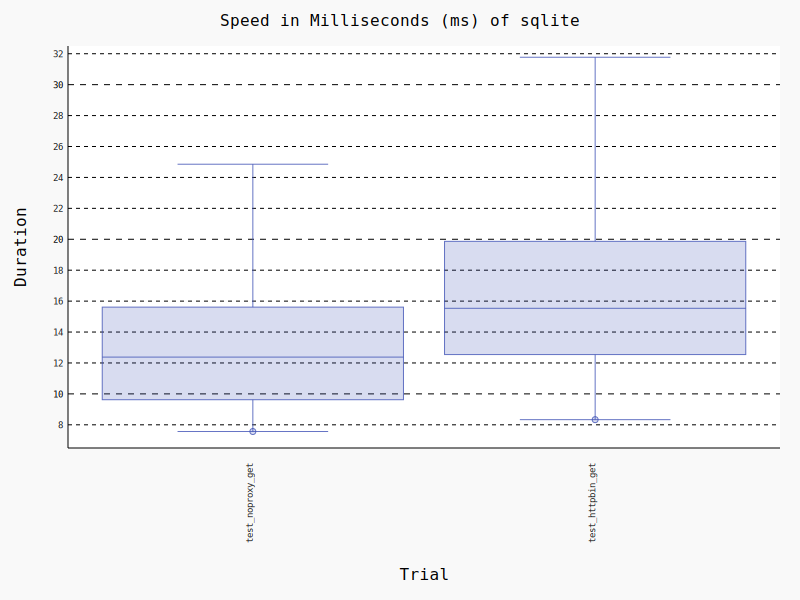

Version 0.2.2 (2023-12-18)
==========================

Changes
:::::::

* feat: tuning benchmarks (Romain Dorgueil)
* feat: the benchmark industry™ (Romain Dorgueil)
* feat: adds a proof of concept of using pytest-benchmarks for measuring performances (Romain Dorgueil)
* feat: response now uses cimultidict for headers (Romain Dorgueil)
* feat: requests now uses CIMultiDict for headers. (Romain Dorgueil)
* feat: typography (Romain Dorgueil)

Benchmarks
::::::::::

PostgreSQL
----------

.. figure:: benchmarks/0.2.2-postgresql.svg

SQLite
----------

