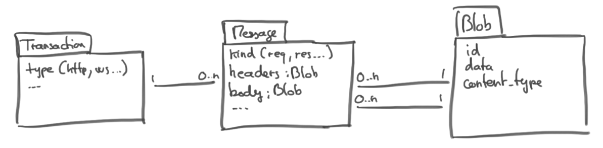

Storage
=======

Storage implementations are in charge of persisting transactions and messages into a backend (database, memory, ...)
using eventual dependencies.

Each storages should implement the :class:`IStorage <harp.protocols.storage.IStorage>` protocol.

Model
:::::

* a :class:`Transaction <harp.core.models.transactions.Transaction>` represents a transaction that went through the
  proxy. A set of request-response forms a transaction in the case of an HTTP transaction (although the response may
  not be present in case of an in progress transaction or a timed out transaction).
* a :class:`Message <harp.core.models.messages.Message>` represents an atomic message that went through the proxy. An
  http request or response is a message.
* a :class:`Blob <harp.core.models.messages.Blob>` represents a binary content, for example the headers or the body of
  an http request or response.

Protocol
::::::::

.. autoclass:: harp.protocols.storage.IStorage
    :members:
