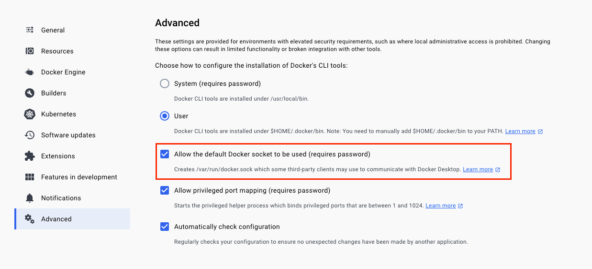

Frequently Asked Questions
==========================

Cookbook
::::::::

How can I start a custom HARP-based proxy project?
--------------------------------------------------

The simplest way is to use the ``harp-proxy create project`` command. It will prompt for a few questions and generate a
project based on a cookiecutter template. Once generated, you'll have ``make install``, ``make start`` and ``make
test`` available within your newly created project.

The generated project uses **UV** for fast dependency management (not Poetry), with a modern PEP 621 compliant
``pyproject.toml`` and Python 3.13 compatibility.

You can read more about project creation in the :doc:`developer guide </develop/quick-start>`.

How can I add an ASGI middleware from my HARP application?
----------------------------------------------------------

You should use the ``on_ready`` handler to decorate the HARP ASGI implementation with your middleware. Here is a
(conceptual) example of an ``__app__.py`` file that adds a middleware:

.. code:: python

     from harp.config import Application, OnReadyEvent

     async def on_ready(event: OnReadyEvent):
         event.asgi_app = some_middleware(event.asgi_app)

     application = Application(on_ready=on_ready)

Internal development related questions
::::::::::::::::::::::::::::::::::::::

While building the API reference, `sed` complains about "extra characters at the end of d command" on MacOSX. What's wrong?
---------------------------------------------------------------------------------------------------------------------------

This is a known issue with `sed` on MacOSX, which provides its own `sed` version with different syntax.

You can install GNU `sed` via `brew` and use it instead of the default `sed` shipped with MacOSX.

.. code-block:: shell

    $ brew install gnu-sed

The full error may look like the following:

.. code-block:: shell

    $ make reference
    rm -rf docs/reference/python
    mkdir -p docs/reference/python
    sphinx-apidoc --tocfile index -o docs/reference/python harp
    sed -i "1s/.*/Python Package/" docs/reference/python/index.rst
    sed: 1: "docs/reference/python/i ...": extra characters at the end of d command
    make: *** [reference] Error 1

All UI snapchot tests fails, it complains that browser (chromium) executables are not available.
------------------------------------------------------------------------------------------------

If you get the following error...

    Error: browserType.launch: Executable doesn't exist at /.../Chromium
    Looks like Playwright Test or Playwright was just installed or updated.
    Please run the following command to download new browsers:
    ...

... it means that you need to install the browsers that Playwright Test uses to run the tests.

Run::

    make install-dev

It should download the expected browser versions in your local cache, allowing to run the interface tests.

My M1/M2/M3 arm64-based mac complains about the absence of `ld-linux-x86-64.so` when starting the locally built image
---------------------------------------------------------------------------------------------------------------------

Error:

    qemu-x86_64: Could not open '/lib64/ld-linux-x86-64.so.2': No such file or directory

Solution:

.. code-block:: shell-session

    $ DOCKER_RUN_OPTIONS="--platform linux/x86_64" make build run

Tests starts to complain about being unable to fetch the docker server API version (on OSX, at least)
-----------------------------------------------------------------------------------------------------

If you have errors that looks like `docker.errors.DockerException: Error while fetching server API version` when running
the test suite, a docker for desktop upgrade may be the cause.

You need to ask docker for desktop to «Allow the default Docker socket to be used».

Restart your docker daemon and you should be good to go.
