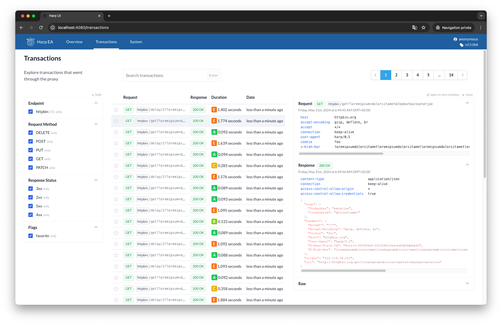

Audit Log
=========

.. versionadded:: 0.5

The Audit log is a core system of HARP that records the transactions passing through the proxy (HTTP requests and
responses, whether or not forwarded to a remote backend) in a storage for future inspection.

.. warning::

    **Recording is best-effort, and the name overpromises.** Under load, storage sheds message detail and then whole
    transactions rather than slowing traffic down, and nothing tells you it happened. Treat this as an operational
    view of your traffic rather than a complete one, and do not rely on it as evidence. See
    :ref:`what-harp-retains` and `#945 <https://github.com/msqd/harp/issues/945>`_.

Enabled by default, it allows viewing transaction content on the HARP dashboard. Transactions are cleaned up by the
:doc:`Janitor Application <../apps/janitor/index>` after a configured delay (default is 2 months).

It is implemented by two applications working together:

- In the :doc:`Proxy Application <../apps/proxy/index>`, the
  :class:`HttpProxyController <harp_apps.proxy.controllers.HttpProxyController>` dispatches transaction-related events.
- In the :doc:`Storage Application <../apps/storage/index>`, the
  :class:`StorageAsyncWorkerQueue <harp_apps.storage.worker.StorageAsyncWorkerQueue>` reacts to these events and
  attempts to store them asynchronously in a storage.

When the background worker falls behind, it skips storing transaction data to maintain the system's ability to process
requests. This is not a rare edge: in a measured sweep on PostgreSQL, roughly 80% of transactions were never stored and
two thirds of the rows that were stored held no messages. Proxying stayed healthy throughout, so the traffic was served
correctly and only the record of it was lost. `#945 <https://github.com/msqd/harp/issues/945>`_ carries the
measurements and the conditions they were taken under.
