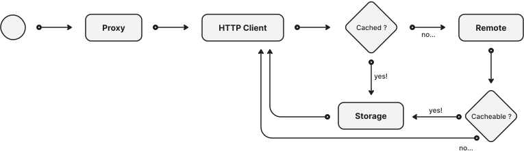

Caching
=======

.. versionadded:: 0.5

By default, HARP leverages a RFC-9111 compliant caching system that will reduce the remote trafic, when possible,
lightening the network pressure to the remote APIs and enhancing your client's API usage experience by lowering the
response time when permited.

For non-compliant or not cache-optimized APIs (which are, unfortunately, more than common), you can leverage the
:doc:`Rules Engine <rules>` to enforce rules based on your specific environment knowkledge.

More informations are available in the :ref:`Proxy / Cache Feature <cache>` documentation.
