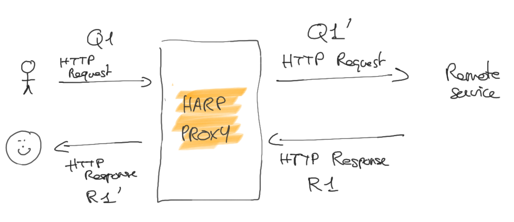

HTTP Proxy
==========

The HTTP Proxy is the very core feature of Harp. It is intended to be used as a sidecar, a service that runs just next
to your application. We call it "nearline proxy", because the network roundtrip to your service must be minimal to
non-existent for the proxy to give the most value.

   Basic HTTP proxy schema

.. todo::

    Redraw the schema to make explicit the fact that user is in fact the user's application, and that harp is running
    nearline.

Harp proxies all HTTP methods, including non-standard ones. Some methods have special behaviors, like `HEAD` (response
body is ignored). But except for very special cases, Harp does not make any assumption about the HTTP method used.
