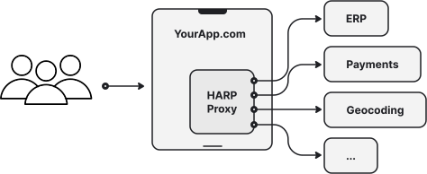

Proxy
=====

The main feature of HARP Proxy is the HTTP Proxy, enabling to define pools of upstream servers, and route requests to
them based on various criteria.

Basics
::::::

The application's basic behavior is to define named ports (which HARP will listen to locally) for forwarding all HTTP
requests to remote servers (unless intercepted by the caching system or a custom rule).

.. literalinclude:: ../apps/proxy/examples/basics.yml
    :language: yaml

This is the simplest working configuration, but there are many options to define more complex behaviors.

Multiple ports
::::::::::::::

You can define multiple ports to listen to, each with its own target configuration.

Typically, you'll define one port per external (or semi-external) API you want to use.

.. literalinclude:: ../apps/proxy/examples/multiple.yml
    :language: yaml

Remote pools
::::::::::::

.. versionadded:: 0.7

You can define a pool of remote URLs instead of a single remote URL. These URLs will be used in a round-robin manner.

.. literalinclude:: ../apps/proxy/examples/pooled.yml
    :language: yaml

Fallback pools
::::::::::::::

.. versionadded:: 0.7

A fallback pool can be defined to be used when the main pool is unavailable or insufficient.

The default minimum pool size is 1. If the pool size falls below this threshold, the fallback pool will be used. This
setting can be modified.

.. literalinclude:: ../apps/proxy/examples/pooled-fallback.yml
    :language: yaml

.. _probes:
Healthchecks probes
:::::::::::::::::::

.. versionadded:: 0.7

The health of the remote servers will be assessed based on the responses received. If the error rate is too high, the
server will be marked as unhealthy and removed from the pool. If the pool lacks sufficient remotes, fallback servers
will be added to the active pool.

To customize this default behavior, you can add a healthcheck probe to regularly request a specific URL to evaluate the
remote service's health.

.. literalinclude:: ../apps/proxy/examples/pooled-healthcheck.yml
    :language: yaml

Client
::::::

.. versionadded:: 0.5

The HTTP client allows the definition of global settings for outgoing HTTP requests, such as timeouts, caching logic,
headers, and more.

.. literalinclude:: ../apps/http_client/examples/simple.yml
    :language: yaml

.. _cache:
Caching
:::::::

.. versionadded:: 0.5

A default cache is provided to store responses and reduce redundant network calls. The cache can be disabled or
fine-tuned.

The default implementation is based on a conservative RFC-9111 compliant cache, but you can set it to be more
aggressive or even switch it entirely to your own implementation.

.. literalinclude:: ../apps/http_client/examples/cache.yml
    :language: yaml

Reference
:::::::::

* :doc:`Proxy & Endpoints </apps/proxy/index>`: Configuration for endpoints, names, ports, and routing.
* :doc:`Http Client </apps/http_client/index>`: Configuration for timeouts, caching, and other HTTP client behaviors.
