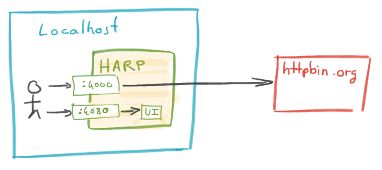

Harp — HTTP API Runtime Proxy
=============================

Harp runs as a sidecar proxy between your app and remote APIs to enhance their reliability, performances and security
while adding observability and lowering the amount of userland code you'll need to write for common non-business needs.

Harp can be used both as a development and a production tool, for different purposes.

The core runtime is mostly composed of a proxy, which can be configured to forward requests to different endpoints, and
a dashboard, which can be used to observe the requests going through the proxy.

All features are implemented as composable independant modules (called applications) and can be enabled, disabled,
extended or arranged in different ways to fit your needs. Reasonable defaults will get you started in a breeze, but
you get infinite flexibility to adapt the proxy to your needs.

Content
:::::::

.. toctree::
   :maxdepth: 2

   quickstart/index
   features/index
   installation/index
   commandline/index
   configuration/index
   reference/index
   development/index
   faq

Indices and tables
::::::::::::::::::

* :ref:`genindex`
* :ref:`modindex`
* :ref:`search`
