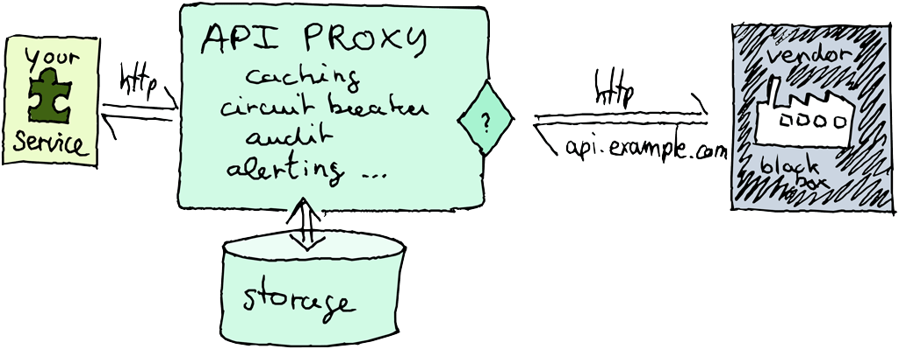

HARP — HTTP API Runtime Proxy
=============================

.. table::
    :class: intro
    :widths: 15 85

    +------------------------------+------------------------------------------------------------------------------------+
    | .. figure:: /images/logo.png | `HARP Proxy <https://harp-proxy.net/>`_ is a forward proxy sitting between your    |
    |    :alt: HARP logo           | application(s) and remote APIs, to improve their reliability, performances, and    |
    |                              | security. It adds builtin observability features via its dashboard and monitoring, |
    |                              | and reduces the amount of userland code required for common HTTP-related,          |
    |                              | non-business features.                                                             |
    |                              |                                                                                    |
    |                              | Whether you are in the development phase or ready for production, HARP serves as a |
    |                              | handy companion for API consumers.                                                 |
    +------------------------------+------------------------------------------------------------------------------------+

.. include:: /_quicktoc.rst

Architecture Overview
:::::::::::::::::::::

Table of Content
::::::::::::::::

.. toctree::
   :maxdepth: 2

   /start/index

.. toctree::
   :maxdepth: 2
   :caption: Guides

   /features/index
   /user/index
   /operate/index
   /develop/index
   /contribute/index

.. toctree::
   :maxdepth: 2
   :caption: Reference

   /core/index
   /apps/index
   /config/index
   /commandline/index

.. toctree::
   :maxdepth: 2
   :caption: Miscellaneous

   /changelogs/index
   /faq
   /glossary

Indices and tables
::::::::::::::::::

* :ref:`genindex`
* :ref:`modindex`
* :ref:`tagoverview`
* :ref:`search`
