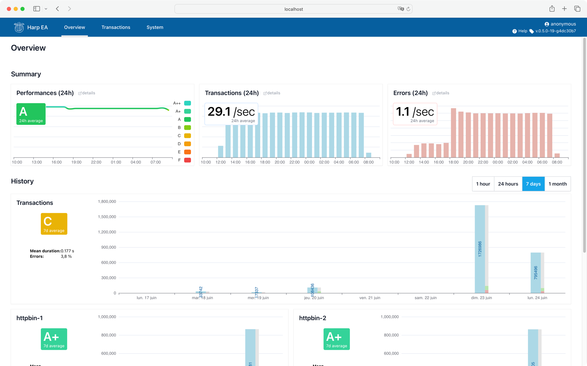

Overview
========

The «Overview» tab shows agregated metrics about the system.

Top metrics shows a quick summary over the last 24 hours, graphs shows agregated statistics for the the selected time
range.

* **Performances**: Average hourly performances of HTTP transactions, over the last 24 hours.
* **Transactions**: Average hourly transaction count, over the last 24 hours.
* **Errors**: Average hourly error count, over the last 24 hours.
* **Transactions Overview**: Detailed transaction count and errors over the selected time range. If you have more than
  one endpoint, one graph per endpoint will be available too.

.. todo:: better screenshots
