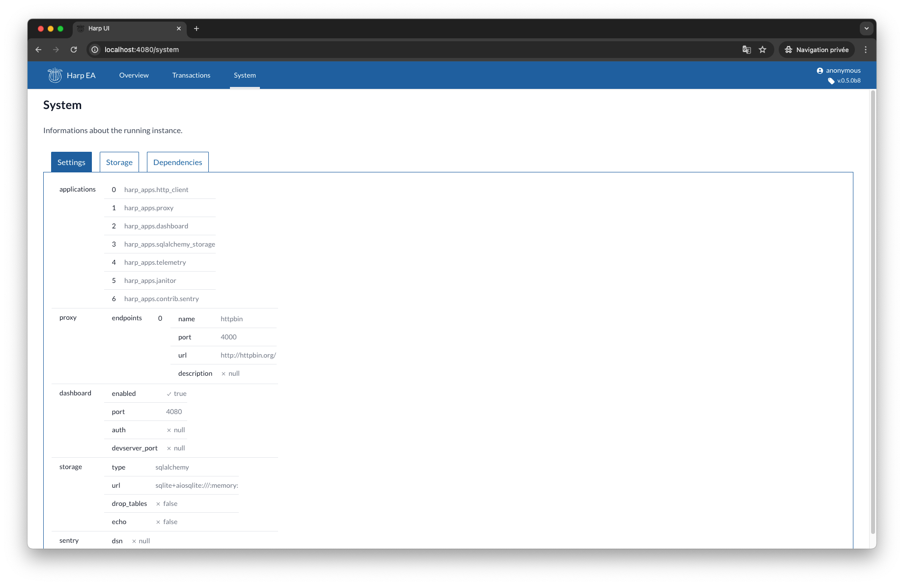
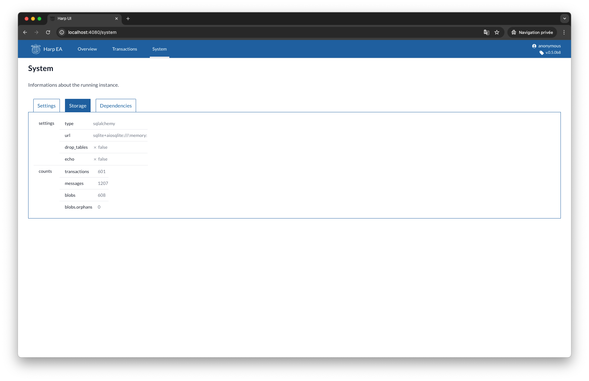
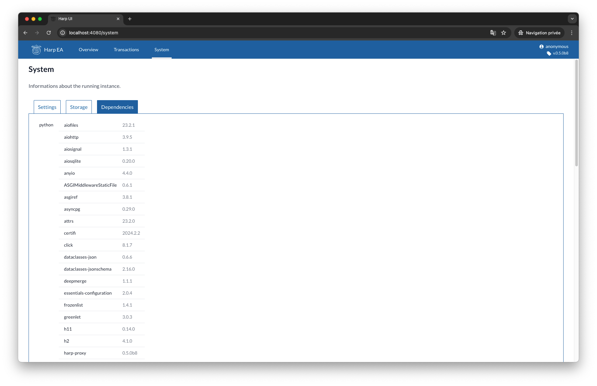

System
======

The «System» tab shows various informations about the currently running instance. It will help operators and developers
to understand how the running instance is configured.

You probably don't need those informations unless you know what you are looking for.

Settings
::::::::

The system settings tab (default) shows the current configuration.

Storage
:::::::

The storage tab shows detailed informations about the current storage, including some usage metrics.

Dependencies
::::::::::::

The dependencies tab shows the installed python dependencies.

