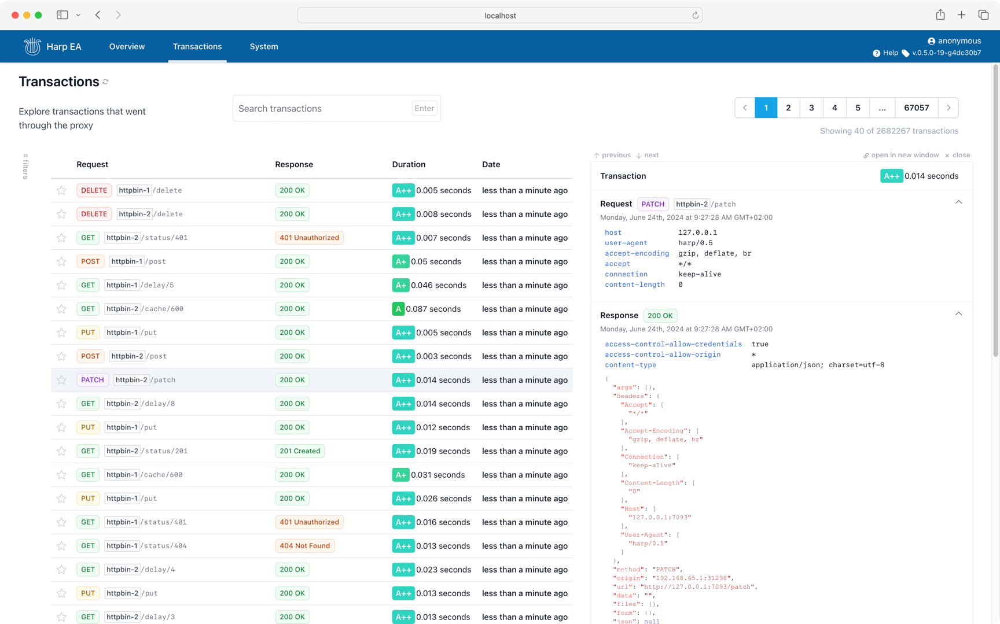
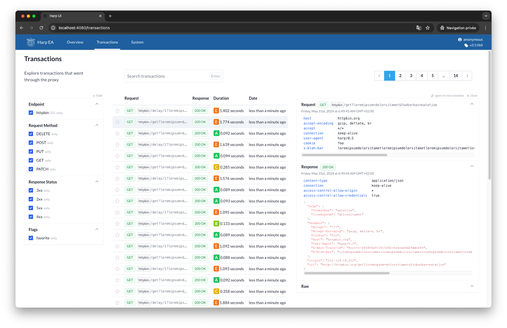

Transactions
============

The «Transactions» tab shows the list of all transactions that passed through the proxies.

You can filter transactions using various criteria, and show the detailed content of each transactions.

Transactions older than 3 months (default) are automatically deleted, unless an user has marked them as favorite.

List (default)
::::::::::::::

Details
:::::::

You can select a transaction and read all transaction content dans details, including the full request and response
headers and body.

.. todo:: better screenshots
