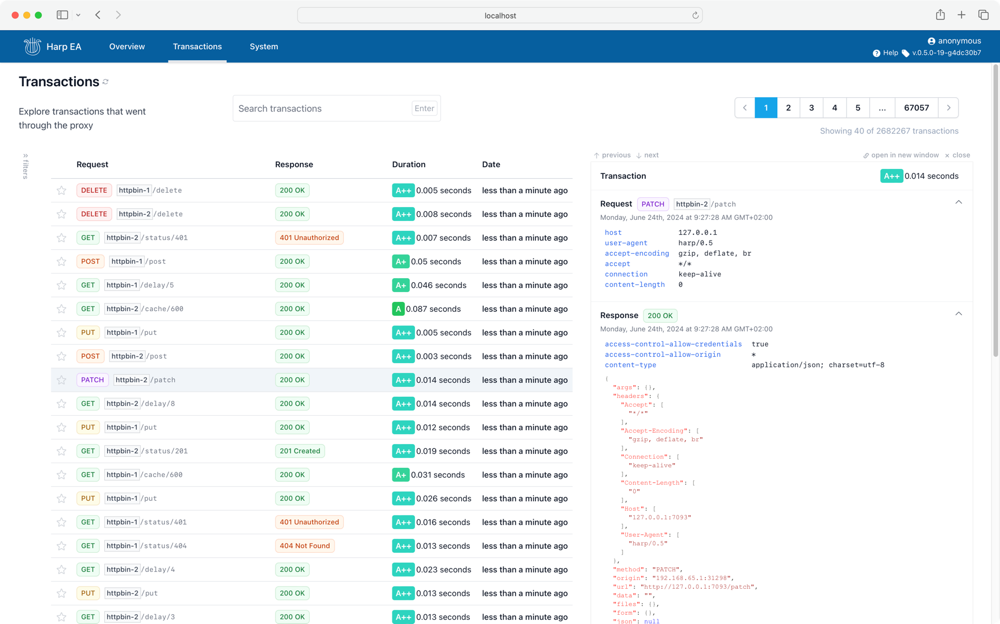

Transactions
============

The «Transactions» tab shows the transactions that passed through the proxies.

You can filter transactions using various criteria, and show the detailed content of each transactions.

.. note::

    **The list is not a complete account of your traffic.** Recording is best-effort: under load, HARP sheds message
    detail and then whole transactions rather than slowing traffic down, so a transaction you made may be absent and a
    transaction shown here may have no content stored. An empty request or response panel can mean the payload was
    shed, not that nothing was sent. See :ref:`what-harp-retains`.

Transactions older than 2 months (default) are automatically deleted, unless an user has marked them as favorite.

List (default)
::::::::::::::

Details
:::::::

You can select a transaction and read all transaction content dans details, including the full request and response
headers and body.

.. figure:: images/transactions-details.png

.. todo:: better screenshots
